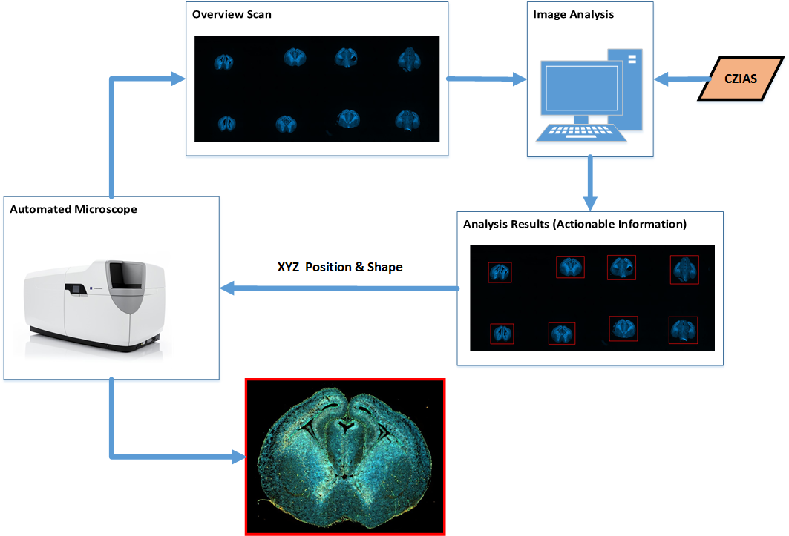
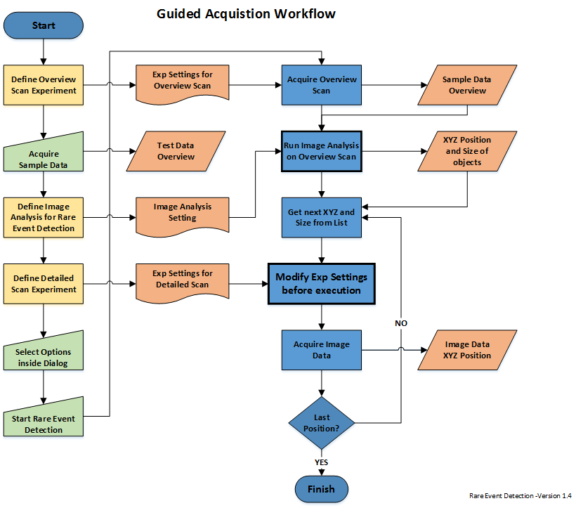
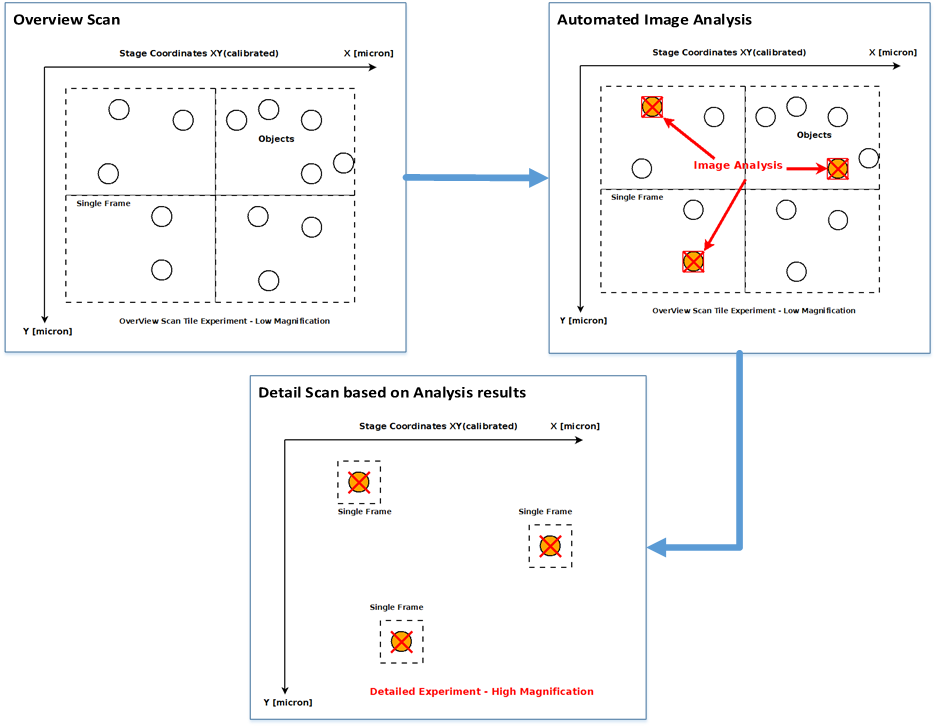

==================================
ZEN Blue OAD Workshop
==================================

OAD and Automated Microscopy – Smart Acquisition Strategies and Automation Tools
ZEN Blue is an open, flexible and powerful image acquisition platform that allows controlling a wide range of microscopes system. Additionally it offers various tools to automate workflows including acquisition and image analysis tasks.
Since that linkage and the automation of such workflows becomes increasingly ZENTo fulfill those demands the ZEN Blue platform offers various features and options, which are combined inside a concept called Open Application Development (OAD). It main components are:

*    Open CZI image data format
*    Python Scripting
*    Interfaces to ZEN
*    Experiment Feedback   

The workshop will give an overview about the various options and use cases allowing the user to start automating their workflows. Different examples will be explained in detail and during hands-on sessions.

Requirements
----------------------
* `ZEN Blue 2.3 <https://www.zeiss.com/microscopy/int/products/microscope-software/zen.html>`_
* `Python 3.5.2 (optional) <http://www.python.org>`_
* `BioFormatsRead Scripts (optional) <https://github.com/sebi06/BioFormatsRead>`_
* `MATLAB (optional) <https://www.mathworks.com/products/matlab.html>`_

Acknowledgements
----------------
*   The ZEN Reserach & Developemt Team

References
----------
(1)  CZI - Image format for microscopes
     http://www.zeiss.com/czi
(2)  The OME-TIFF format.
     http://www.openmicroscopy.org/site/support/file-formats/ome-tiff

Screenshots
-----------

Disclaimer
----------
*   Remark: Please use at your own risk.

:Author: Sebastian Rhode

:Version: 2017.05.02
